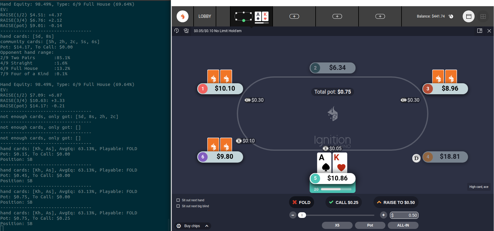
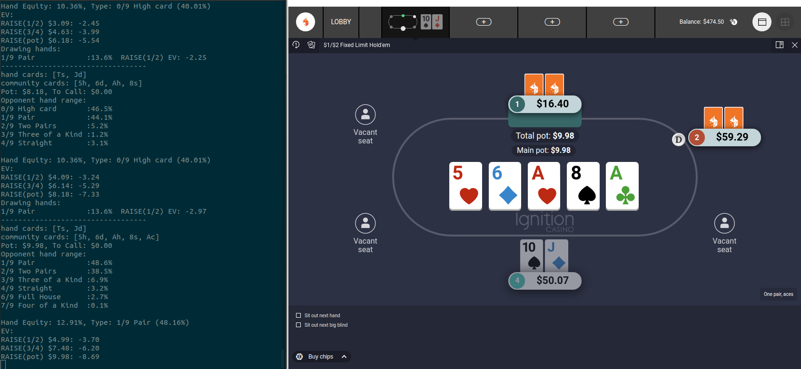

# Poker ML

This was my 2020 winter break project.  
Primary objectives: refresh my memory of ML, and get a bit better with Rust, as well as have some fun playing poker texas hold'em.
It might be a good project for someone to start with and expand on it.  
Everything is tested on [Ingition Casino](https://www.ignitioncasino.eu/welcome/PQQWEAY/join?extcmpid=rafcopy) web poker interface. I used web interface and that particular online casino because I use linux, and none of them have clients for linux.  

Disclaimer: project is named poker_ml, implying that there is some sort of machine learning applied to poker game, but in reality ML is used only for card recognition.  

This project consists of several sub-projects.

## Hand Ranker

This was taken from this [github project](https://github.com/dirusali/pokerodds)  
I only used `scores.py` part of it to categorize different hands. Also had to fix some bugs in it as well, as some hands were not categorized correctly.  
When running `scores.py` it will generate `hands.csv` file that contains all 2.6 million hand combinations that can be made with 52 card deck in texas hold'em. This file is then used in `expected_value` sub project.  

## Card Recognizer ML

This is a simple CNN machine learning project.  
It is trained to recognize cards and dealer button. All train and validate data included.  

## OCR

This uses [tesseract](https://tesseract-ocr.github.io/) to convert pot value into a string that can be used later on. It is also used to convert call amount into string as well.  
It works remarkably well after a bit of fine tuning.  

## Expected Value

This is the main part of the project. It takes input from card recognizer and ocr to get a state of current game. And then it outputs some data that can be useful during the game.  
`Pre flop`: It will output information about average equity of your starting hands, as well as it will take your position on the table and will tell you if your cards are playable in that position or if they should be folded. Playable card ranges are hard coded currently.  
`Post flop`: It will tell your current hand's equity (how it compares in strength to possible range of opponent's hands), as well as based on equity will calculate your EV of raising or calling. Also if you have a drawing hand, it will show odds of completing your draw.  
It will also show possible hands that your opponent might have as well as a probability of having those hands.  

## Orchestrator

This takes pixel coordinates of all relevant cards (currently hard coded).  
Takes screenshots of those areas 10 times a second.  
If it detects a change, it runs those screenshots through card recognizer and ocr, and passes that data into `expected_value` program, which then spits out valuable information for you to act upon.  
It runs really fast on my machine. Once cards are dealt, I get results back in less then a second.  

## Requirements

Everything is tested on Ubuntu 20.04.  
You need nVidia GPU to run ML (it is possible to run without GPU but you will need to tweak docker image used for tensorflow to use base image without GPU support I think).  
You need docker installed to run docker images.  
You need Python3 and Rust installed.  

## How to use

If you want to give this project a try (and maybe even expand on it)  

1. Create an account on [Ignition Casino](https://www.ignitioncasino.eu/welcome/PQQWEAY/join?extcmpid=rafcopy)
2. Use their web interface to play poker. Only texas hold'em is supported in this project.
3. Run `hand_ranker/scores.py` to generate `hands.csv` file. Copy that file into `expected_value/data/hands.csv`.
4. There are some hard coded paths at the top of `main()` function in `expected_value/src/main.rs`. Update them to match your environment.
5. Run `cargo build --release` in `expected_value` to compile rust project.
6. Run `expected_value` executable to generate all necessary data (that might take a minute or two). It will save all data, so that next run will be fast.
7. Run `make image` in `card_recognizer_ml` to create docker image for that project.
8. Run `make image` in `ocr` to create docker image.
9. Run `make run` in the root folder of the project. It should start two containers and should start scanning for changes.
10. ...
11. Profit!

## Screenshots

Pre-flop example:

Post-flop example:

